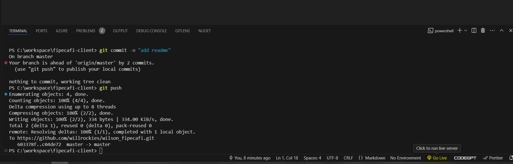

# wilson_fipecafi

para rodar o projeto local utilizei o plugin do proprio server do proprio VSCode assim sendo deve se clica em Go Live para o projeto rodar em um servido local 

vê capturar.JPG

!alt text capturar.JPG  
